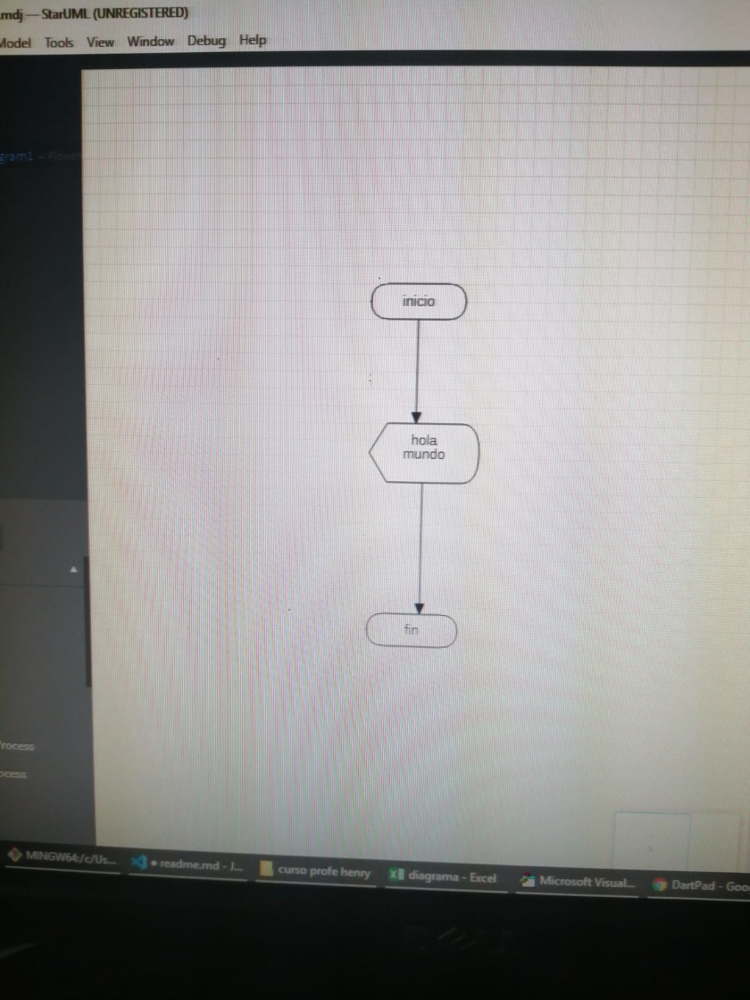

# Septiembre 2 de 2021

En esta clase aprendi como trabajar en las diferentes variables como lo son staruml, excel. darpad y atoom

## Ejercicio en excel

``
Sub inicio

    MsgBox "hola peña"
    MsgBox "espero estes bien"
    MsgBox "hasta luego"
End Sub
``

## Ejercicio en darpad

void main() {
  print ( hola mundo );
  print ()
}
``
## Ejercicio staruml

