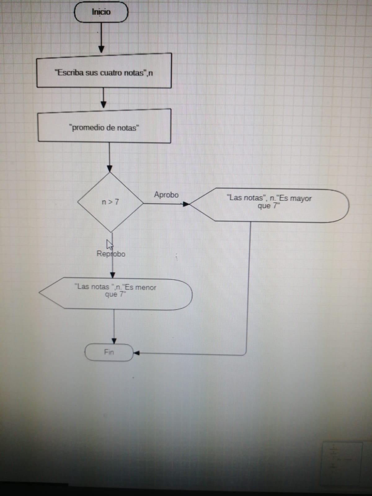

Septiembre 13 de 2021

Clases de programacion en distintos escenarios

## StarUML

## atoom

``
inicio

    lea "escriba una nota",n1
    lea "escriba una nota",n2
    lea "escriba una nota",n3
    lea "escriba una nota",n4
    d = n1 + n2 + n3 +n4
    lea "el promedio de nota es",d / 4
    si n > 7 entonces
        escriba"el promedio",n,"es mayor que 7"
    si no
        escriba"el promedio",n,"es menor que7"
    fin si
``

## Visual basic

``
Sub inicio()

    n1 = Int(InputBox("primera nota"))
    n2 = Int(InputBox("segunda nota"))
    n3 = Int(InputBox("tercera nota"))
    n4 = Int(InputBox("cuarta nota"))
    d = n1 + n2 + n3 + n4
    t = d / 4
    If (t > 7) Then
        MsgBox "con la nota " & t & " el estudiante aprobo "
    Else
        MsgBox "con la nota " & t & " el estudiante reprobo "
    End If
End Sub
``

## darPAD

``
void main(){

    int a = 10;
    int b = 10;
    int c = 5;
    int d = 5;
    int e = a + b + c + d;
    if (e > 7){
        print("el numero $e es mayor que 7");
    }else{
        print("el numero $e es menor o igual a 7");
  }
}
``