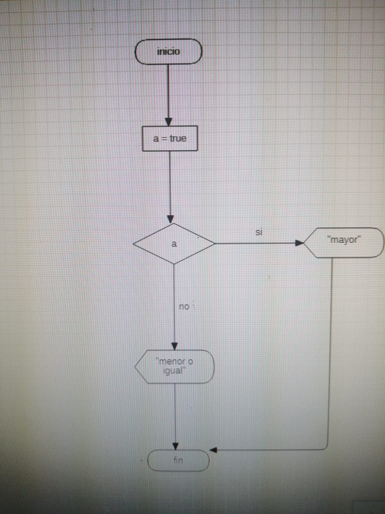

# Septiembre 16 2021

En esta clase vimos la variable bool

## Staruml

## darPAD

``

    void main(){
  
    bool a = false;
  
    if (a){
        print("verdad");
    }else{
        print("no verdad");
    }
    }
``

## Visual Basic

``

    Sub prueba1()
    a = True
    
    If a Then
        MsgBox ("verdad")
    Else
        MsgBox ("falso")
    End If
    
    End Sub
``