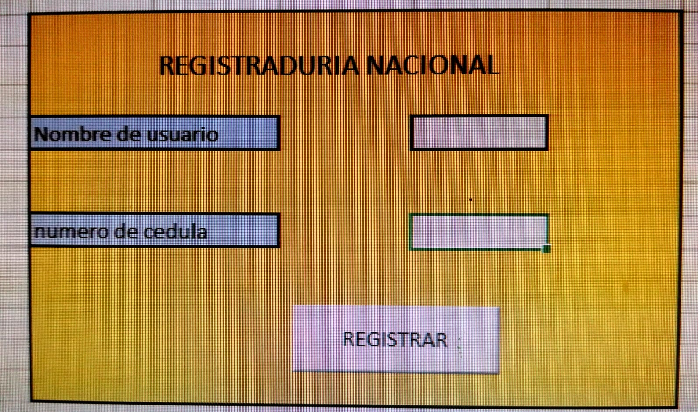

# Septiembre 20 de 2021

Clases de funcion con diferentes variable

## Visual Basic

### Funcion

``

    Function misnotas(a, b, c, d, e)
    promedio = (a + b + c + d + e) / 5
    
    If (promedio > 7) Then
        misnotas = "con la nota " & promedio & " el estudiante aprobo "
    Else
        misnotas = "con la nota " & promedio & " el estudiante reprobo "
    End If
    End Function

## Visual basic

### Prueba 1

``

    Sub prueba1()
    datos.Cells(6, 1) = form.Cells(9, 7)
    datos.Cells(6, 2) = form.Cells(12, 7)
    MsgBox "datos ingresados"
    form.Cells(9, 7) = Empty
    form.Cells(12, 7) = ""
    
    End Sub
``

