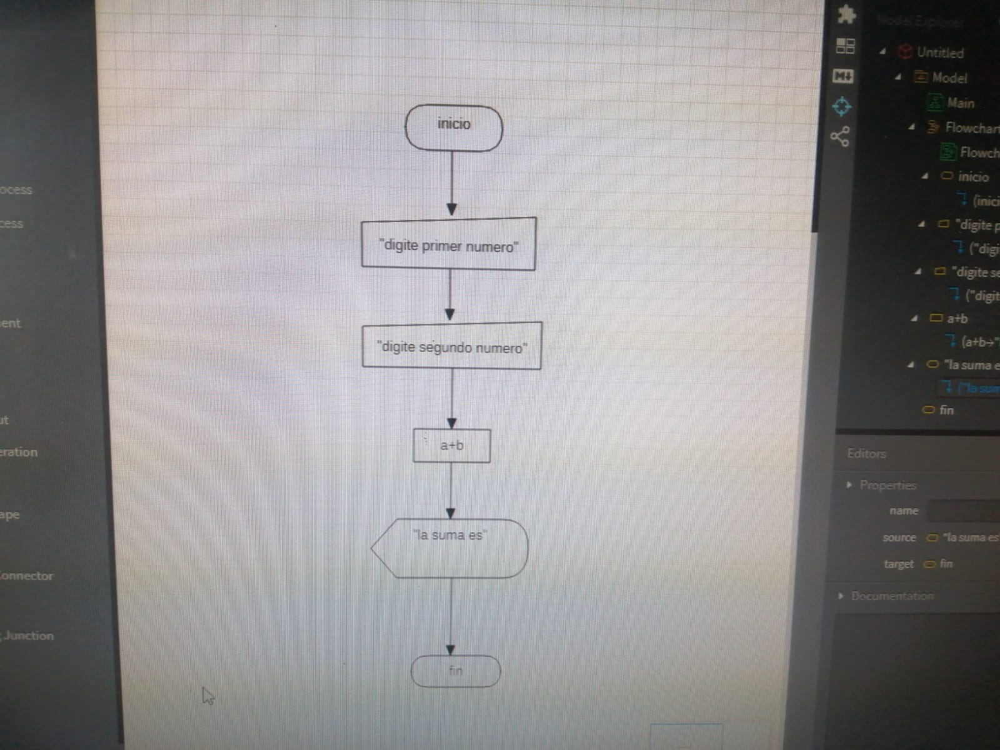

# Septiembre 9 del 2021

En esta clase aprendi a programar en los distintos escenarios 

## Ejercicio en estaruml

## Ejercicio en editor visual estudio code

inicio
    lea "digite primer numero", a
    lea "digite segundo numero", b
    lea "digite tercer numero", c
    lea "digite cuarto numero", d
    lea "digite quinto numero", e
    f = a + b + c + d + e
    g = f / 5
    escriba "el promedio es", g
fin

## Ejercicio en visual basic

``
Sub inicio()
    a = InputBox("digite primer numero")
    b = InputBox("digite segundo numero")
    c = InputBox("digite tercer numero")
    d = InputBox("digite cuarto numero")
    e = InputBox("digite quinto numero")
    f = Int(a) + Int(b) + Int(c) + Int(d) + Int(e)
    g = Int(f) / 5
    MsgBox "el promedio es = " & g
End Sub
``
## Ejercicio en darpad

``
void main(){
  int a = 10;
  int b = 20;
  int c = 5;
  int d = 10;
  int e = 15;
  int f = a + b + c + d + e;
  print("el resultado de la suma es $f");
}
``